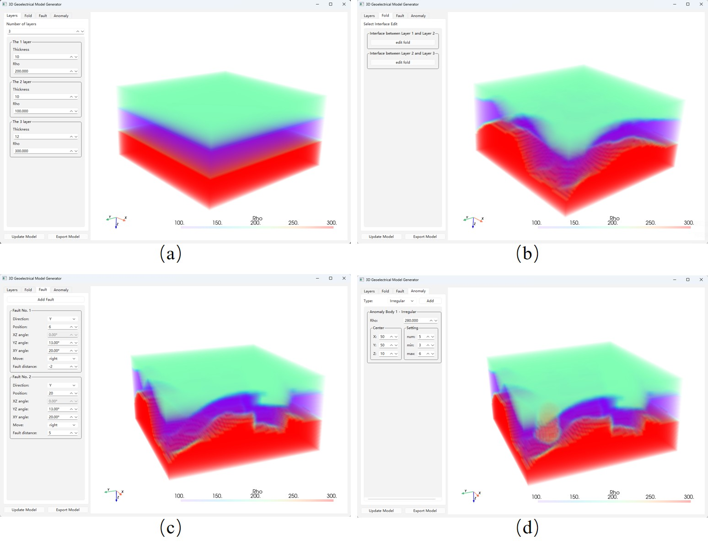

# Geoelectrical3D

This is a fully controllable model generation tool for OpenEM. Simply click the exe file to run.

## Features

- **Fully Controllable Model Generation**: Provides complete control functionality for 3D geoelectrical models
- **OpenEM Compatible Tool**: Specifically designed model generation tool for OpenEM system
- **Convenient Execution**: Provides executable file without complex installation configuration

## Running Method

- Run directly by clicking the exe file
- No additional dependency environment configuration required

